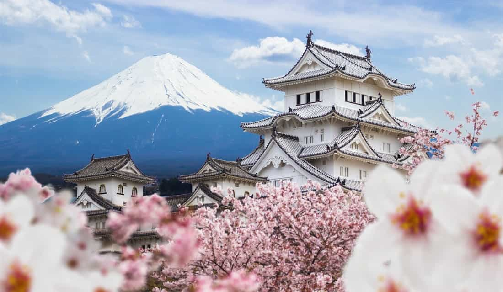
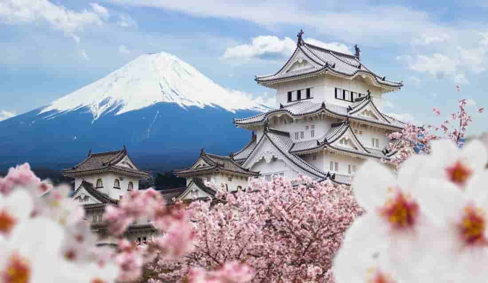
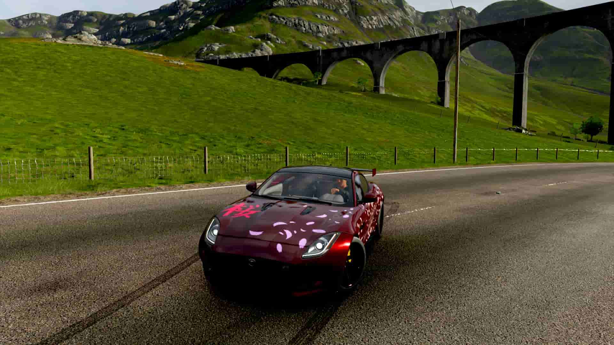
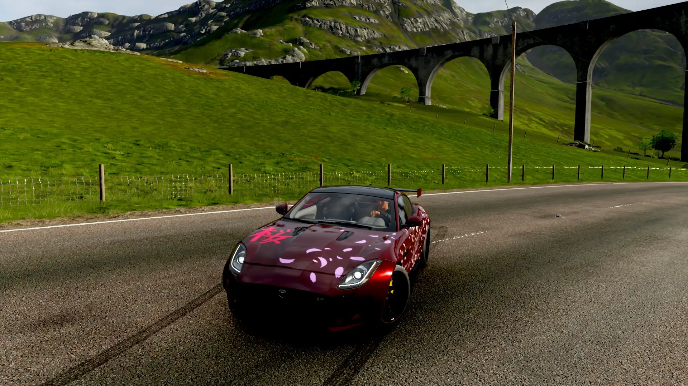
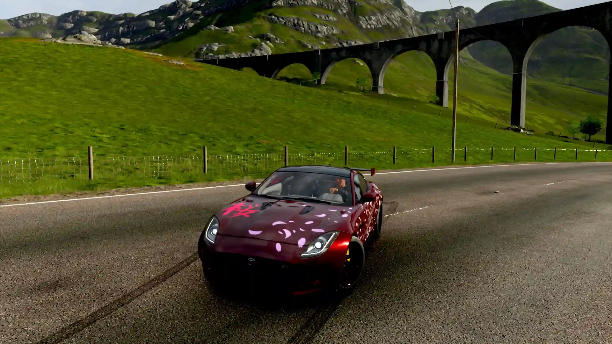
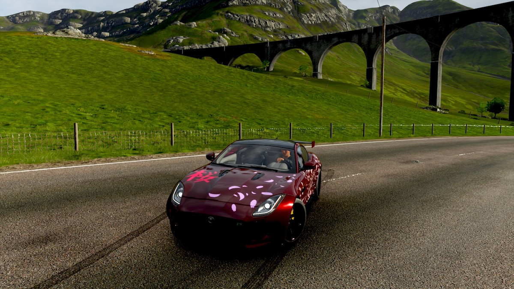
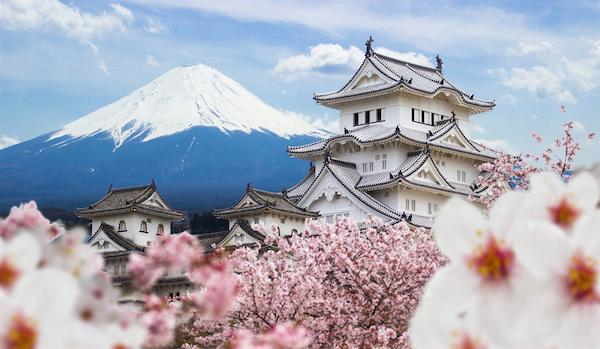
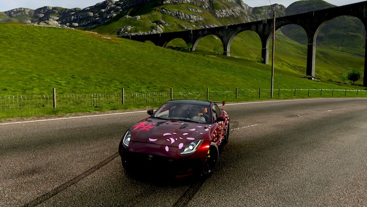
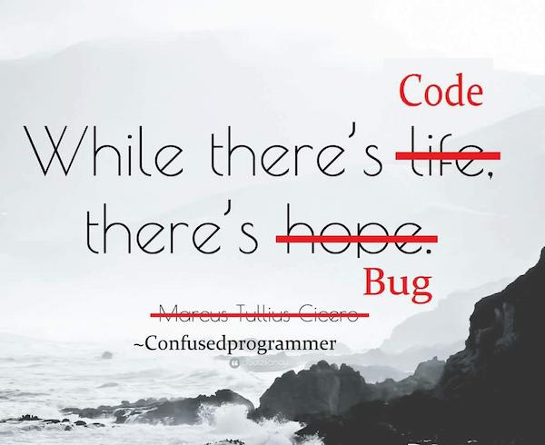

# Практична робота №1; ІПЗ 2.02 Замша Даніїл
# “Оптимізація зображень в середовищі Squoosh”

## Вхідні зображення

| Назва зображення | Формат зображення | Розмір зображення | Вага зображення |
|------------------|-------------------|-------------------|--------------|
| picture1         | jpg               | 1100x639         | 175 kB          |
| picture2         | jpg               | 1920x1080          | 654 kb        |
| picture3         | jpg               | 1175x960         | 50.2 kb          |

#### picture1:

#### picture2:

#### picture3:

---

## Lossless

### WebP

| Назва зображення | Формат зображення | Розмір зображення | Вага зображення | Зміна   |
|------------------|-------------------|-------------------|-----------------|---------|
| picture1         | WebP              | 1100x639         | 632 kb          | +252%    |
| picture2         | WebP              | 1920x1080       | 2.43 MB       | +263%   |
| picture3         | WebP              | 1175x960         | 248 kb          | +381%   |

#### picture1:

#### picture2:

#### picture3:

---

### Png

| Назва зображення | Формат зображення | Розмір зображення | Вага зображення | Зміна |
|------------------|-------------------|-------------------|-----------------|-------|
| picture1         | png               | 1100x639         | 1.14 Mb         | +536%  |
| picture2         | png               | 1920x1080       | 3.37 Mb         | +463% |
| picture3         | png               | 1175x960         | 515 kb            | +900% |

#### picture1:

#### picture2:

#### picture3:

---

## Lossy

### MozJPEG (100% quality)

| Назва зображення | Формат зображення | Розмір зображення | Вага зображення | Зміна |
|------------------|-------------------|-------------------|-----------------|-------|
| picture1         | jpg               | 1100x639         | 378 kb          | +111%  |
| picture2         | jpg               | 1920x1080       | 1.70 MB        | +154% |
| picture3         | jpg               | 1175x960         | 157 Kb          | +206% |

#### picture1:

#### picture2:

#### picture3:

---

### MozJPEG (75% quality)

| Назва зображення | Формат зображення | Розмір зображення | Вага зображення | Зміна |
|------------------|-------------------|-------------------|-----------------|-------|
| picture1         | jpg               | 1100x639         | 84.4 Kb         | -53%  |
| picture2         | jpg               | 1920x1080        | 315 Kb         | -53%  |
| picture3         | jpg               | 1175x960         | 51.4 Kb          | -0%  |

#### picture1:

#### picture2:

#### picture3:

---

### MozJPEG (50% quality)

| Назва зображення | Формат зображення | Розмір зображення | Вага зображення | Зміна |
|------------------|-------------------|-------------------|-----------------|-------|
| picture1         | jpg               | 1100x639         | 53.1 kb         | -70%  |
| picture2         | jpg               | 1920x1080       | 185 Kb          | -72%  |
| picture3         | jpg               | 1175x960         | 37.1 Kb         | -28%  |

#### picture1:

#### picture2:

#### picture3:

---

### MozJPEG (minimum quality)

| Назва зображення | Формат зображення | Розмір зображення | Вага зображення | Зміна | Якість |
|------------------|-------------------|-------------------|-----------------|-------|--------|
| picture1         | jpg               | 1100x639         | 26.0 Kb         | -86%  | 20%    |
| picture2         | jpg               | 1920x1080       | 79.3 Kb         | -88%  | 20%    |
| picture3         | jpg               | 1175x960         | 18.5 Kb         | -64%  | 15%    |

#### picture1:

#### picture2:

#### picture3:

---

### WebP (100% quality)

| Назва зображення | Формат зображення | Розмір зображення | Вага зображення | зміна |
|------------------|-------------------|-------------------|-----------------|-------|
| picture1         | WebP              | 1100x639         | 248 KB          | +38%  |
| picture2         | WebP              | 1920x1080       | 1.04 MB        | +56%  |
| picture3         | WebP              | 1175x960         | 115 Kb          | +122%  |

#### picture1:

#### picture2:

#### picture3:

---

### WebP (75% quality)

| Назва зображення | Формат зображення | Розмір зображення | Вага зображення | зміна |
|------------------|-------------------|-------------------|-----------------|-------|
| picture1         | WebP              | 1100x639         | 75.3 Kb         | -58%  |
| picture2         | WebP              | 1920x1080          | 328 Kb         | -51%  |
| picture3         | WebP              | 1175x960            | 39.9 Kb         | -23%  |

#### picture1:

#### picture2:

#### picture3:

--- 

### WebP (50% quality)

| Назва зображення | Формат зображення | Розмір зображення | Вага зображення | Зміна |
|------------------|-------------------|-------------------|-----------------|-------|
| picture1         | WebP              | 1100x639         | 57.2 Kb         | -68%  |
| picture2         | WebP              | 1920x1080       | 235 Kb          | -65%  |
| picture3         | WebP              | 1175x960         | 30.7 Kb         | -40%  |

#### picture1:

#### picture2:

#### picture3:

--- 

### WebP (min quality)

| Назва зображення | Формат зображення | Розмір зображення | Вага зображення | Зміна | Якість |
|------------------|-------------------|-------------------|-----------------|-------|--------|
| picture1         | WebP              | 1080x1013        | 21.8 Kb         | -88%  | 5%    |
| picture2         | WebP              | 1920x1080        | 95.0 Kb         | -86%  | 12%  |
| picture3         | WebP              | 1175x960          | 9.88 Kb         | -81%  | 0%    |

#### picture1:

#### picture2:

#### picture3:

---

### AVIF (quality 100%)

| Назва зображення | Формат зображення | Розмір зображення | Вага зображення | Зміна |
|------------------|-------------------|-------------------|-----------------|-------|
| picture1         | avif              | 1100x639         | 244 Kb           | +36%  |
| picture2         | avif              | 1920x1080       | 973 Kb           | +45%  |
| picture3         | avif              | 1175x960         | 98.3 Kb          | +91%   |

#### picture1:

#### picture2:

#### picture3:

---

### AVIF ( quality 75%)

| Назва зображення | Формат зображення | Розмір зображення | Вага зображення | Зміна |
|------------------|-------------------|-------------------|-----------------|-------|
| picture1         | avif              | 1100x639         | 101 Kb         | -44%  |
| picture2         | avif              | 1920x1080       | 427 Kb         | -36%  |
| picture3         | avif              | 1175x960         | 45.9 Kb         | -11%  |

#### picture1:

#### picture2:

#### picture3:

---

### AVIF (50%)

| Назва зображення | Формат зображення | Розмір зображення | Вага зображення | Зміна |
|------------------|-------------------|-------------------|-----------------|-------|
| picture1         | avif              | 1100x639         | 52.0 Kb         | -71%  |
| picture2         | avif              | 1920x1080       | 210 Kb          | -69%  |
| picture3         | avif              | 1175x960         | 25.3 Kb         | -51%  |

#### picture1:

#### picture2:

#### picture3:

---

### AVIF (minimum quality)

| Назва зображення | Формат зображення | Розмір зображення | Вага зображення | Зміна | Якість |
|------------------|-------------------|-------------------|-----------------|-------|--------|
| picture1         | avif              | 1100x639         | 11.8 Kb         | -93%  | 15%    |
| picture2         | avif              | 1920x1080       | 70.3 Kb         | -90%  | 28%    |
| picture3         | avif              | 1175x960         | 6.62 Kb         | -87%  | 10%    |

#### picture1:

#### picture2:

#### picture3:

---

## Зміна розмірів вхідних зображень

### Для web (width 1200px)

| Назва зображення | Формат зображення | Розмір зображення | Вага зображення | Зміна |
|------------------|-------------------|-------------------|-----------------|-------|
| picture1         | jpg               | 1200x697          | 119 Kb          | -34%  |
| picture2         | jpg               | 1200x675          | 284 Kb          | -58%  |
| picture3         | jpg               | 1200x980         | 82.9 Kb          | +61%  |

#### picture1:

#### picture2:

#### picture3:

---

### Для mobile (width 600px)

| Назва зображення | Формат зображення | Розмір зображення | Вага зображення | Зміна |
|------------------|-------------------|-------------------|-----------------|-------|
| picture1         | jpg               | 600x349           | 39.7 Kb         | -78%  |
| picture2         | jpg               | 600x338           | 75.8 Kb         | -89%  |
| picture3         | jpg               | 600x490           | 32.2 Kb         | -37%  |

#### picture1:

#### picture2:

#### picture3:

---

### Для retina (2x size)

| Назва зображення | Формат зображення | Розмір зображення | Вага зображення | Зміна |
|------------------|-------------------|-------------------|-----------------|-------|
| picture1         | jpg               | 2200x1278         | 271 Kb          | +51%  |
| picture2         | jpg               | 3840x2160         | 1.70 MB        | +153% |
| picture3         | jpg               | 2350x1920         | 182 Kb          | +254%  |

#### picture1:

#### picture2:

#### picture3:

---

## Висновки

