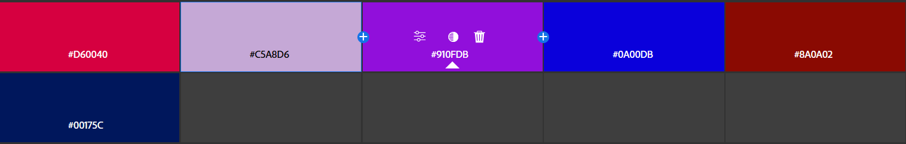

# Практична робота №10; ІПЗ 2.02 Замша Даніїл
# Дослідження кольорових гармоній та інструментів аналізу кольору в Adobe Color
---

## Завдання:
#### 1. Робота з колірним колесом (Color Wheel)
#### 2. Створення палітри зображенням (Extract Theme)
#### 3. Створення градієнту на основі зображення (Extract Gradient)
#### 4. Аналіз контрасту (Accessibility Tools)
---

## 1
#### Обраний базовий кольор - 9110DB

---

#### Створені палітри для кожного типу гармонії
Analogous

Аналогова гармонія - базується на суміжних кольорах колірного кола, створює гармонійний і спокійний настрій, добре підходить для природних, м’яких композицій.
---

Monochromatic

Монохромна гармонія - використовує різні відтінки одного кольору, формує цілісне, чисте враження з м’яким емоційним впливом.
---

Triad

Тріадна гармонія — включає три рівновіддалені кольори на колірному колі, забезпечує яскравий, але збалансований контраст і динамічну атмосферу.
---

Complementary

Комплементарна - поєднує протилежні кольори на колі, створює сильний контраст і виразність, викликає відчуття енергії й напруги.
---

Split Complementary

Розділена комплементарна - поєднує основний колір і два сусідніх до його протилежного, зберігає контрастність, але з більшою гармонією.
---

Square

Квадратна - використовує чотири кольори, рівномірно розподілені по колу, створює яскраву, живу палітру з різноманіттям, але вимагає обережного балансу.
---

Custom

Кастомна гармонія напряму залежить тільки від того, хто її зробив. В данному випадку, було просто обрано відтінки улюблених кольорів.
---
---

