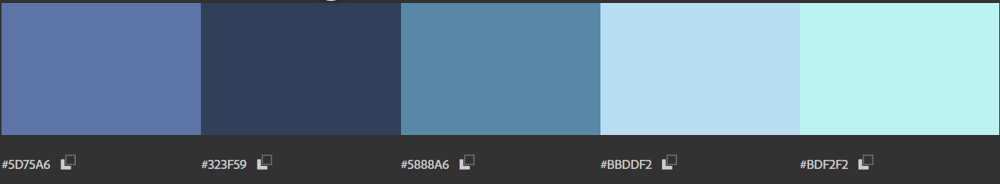

# Практична робота №10; ІПЗ 2.02 Замша Даніїл
# Дослідження кольорових гармоній та інструментів аналізу кольору в Adobe Color
---

## Завдання:
#### 1. Робота з колірним колесом (Color Wheel)
#### 2. Створення палітри зображенням (Extract Theme)
#### 3. Створення градієнту на основі зображення (Extract Gradient)
#### 4. Аналіз контрасту (Accessibility Tools)
---

## 1
#### Обраний базовий кольор - 9110DB

---

#### Створені палітри для кожного типу гармонії
Analogous

Аналогова гармонія - базується на суміжних кольорах колірного кола, створює гармонійний і спокійний настрій, добре підходить для природних, м’яких композицій.
---

Monochromatic

Монохромна гармонія - використовує різні відтінки одного кольору, формує цілісне, чисте враження з м’яким емоційним впливом.
---

Triad

Тріадна гармонія — включає три рівновіддалені кольори на колірному колі, забезпечує яскравий, але збалансований контраст і динамічну атмосферу.
---

Complementary

Комплементарна - поєднує протилежні кольори на колі, створює сильний контраст і виразність, викликає відчуття енергії й напруги.
---

Split Complementary

Розділена комплементарна - поєднує основний колір і два сусідніх до його протилежного, зберігає контрастність, але з більшою гармонією.
---

Square

Квадратна - використовує чотири кольори, рівномірно розподілені по колу, створює яскраву, живу палітру з різноманіттям, але вимагає обережного балансу.
---

Custom

Кастомна гармонія напряму залежить тільки від того, хто її зробив. В данному випадку, було просто обрано відтінки улюблених кольорів.
---
---

## 2
#### Зображення з якого буде зроблено палітру:

#### Colorful

#### Muted

---

На мою думку, палітра coloful буде кращим вибором для створення додатку, пов'язаним із зображенням.
Вона водночас краще передає кольори зображення, особливо темні відтінки, при цьому лишаючись гарно поєднуваємою комбінацією.
Також більш темні відтінки будуть гарно поєднуватися з тематикою фото - автомобілями.
---
---

## 3
#### Градієнт на основі фото

Завантажене зображення:

Градієнт зображення:

---
---

## 4
#### Аналіз контрасту
Оберемо 2 кольори з палітри попереднього зображення:
#010440
#BBDDF2

Рівень контрастності та тести контрастності

---
---

  Висновок: Для дизайну інтерфейсів найкраще підходять аналогова, монохромна та роз'днана комплементарна палітри.
Ці палітри забезпечують візуальну гармонію, легкість сприйняття та чітку ієрархію елементів,що особливо важливо для зручності користувача.
  Занадто контрастні або насичені схеми, як-от тріадна чи квадратна, варто використовувати з обережністю -
вони можуть відволікати або втомлювати користувачів.
