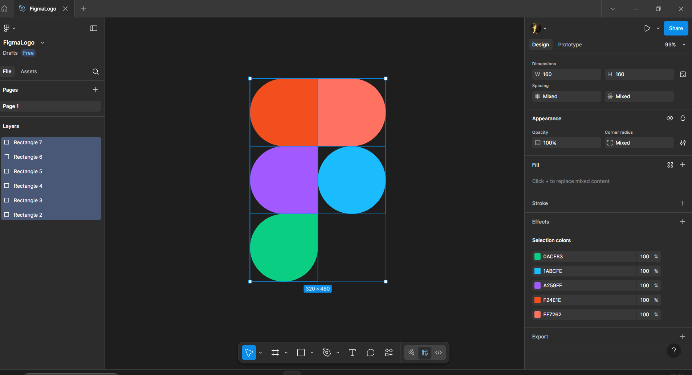

# Практична робота №2; ІПЗ 2.02 Замша Даніїл
# Робота з простими формами та їх властивостями у Figma. Частина 1
---

## Завдання:
#### Використовуючи просту форму (shape tool) Rectangle, створити зображення за прикріпленим зразком (логотип Figma).
---

#### Виконання завдання:
Створити фрейм, додати 5 прямокутників (rectangles), на панелі інструментів налаштувати заокруглення потрібних кутів,
обрати потрібні кольори для кожної фігури.
---

#### Результат:

---

#### Посилання на виконане завдання у Figma
https://www.figma.com/design/9lYRXrPndTogTMvtnklcMy/FigmaLogo?node-id=0-1&t=A8xf3OxKTcEqDfDc-1

