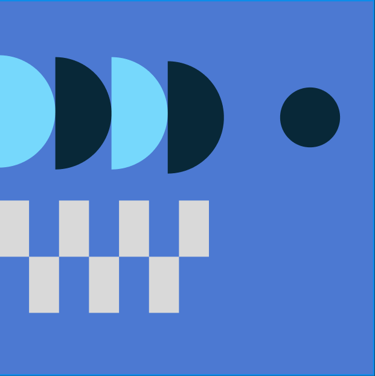

# Практична робота №3; ІПЗ 2.02 Замша Даніїл
# Робота з простими формами та їх властивостями у Figma. Створення геометричного візерунку. Частина 2
---

## Завдання:
#### Використовуючи прості фігури та їх властивості сервісу Figma створити фрагмент геометричного візерунку.
---

#### Результат:

---

#### Посилання на виконане завдання у Figma
https://www.figma.com/design/VNQlC6rxhmZG7RR9RFqzR4/GeometricalPattern?node-id=0-1&t=ETQtINlZfH7BXLzb-1
