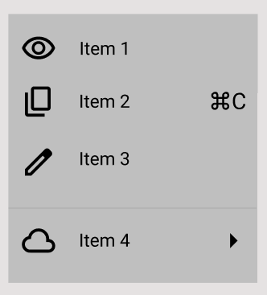

# Практична робота №4; ІПЗ 2.02 Замша Даніїл
# Фрейми, групи і секції у Figma
---

## Завдання:
#### Виконати завдання Basic.
---

#### Результат:

---

#### Посилання на виконане завдання у Figma
https://www.figma.com/design/mbmxpEANGMsK5ifqRkmd2x/Frames?node-id=0-1&t=hJM09XqcAyhUblMQ-1
