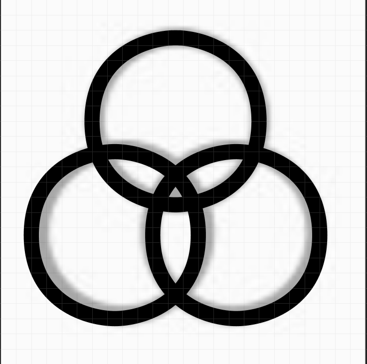
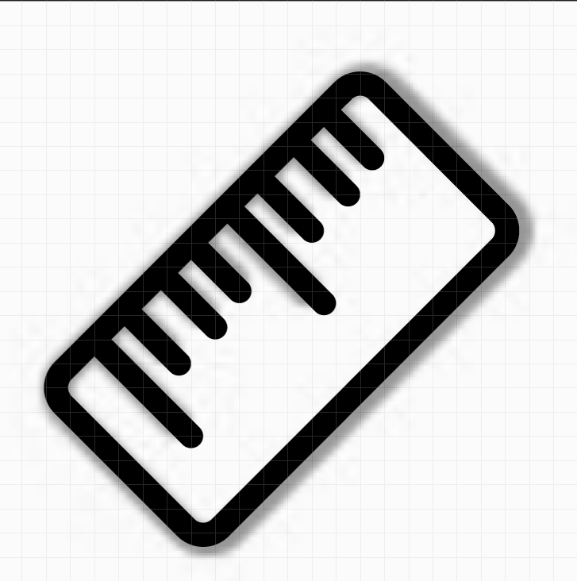
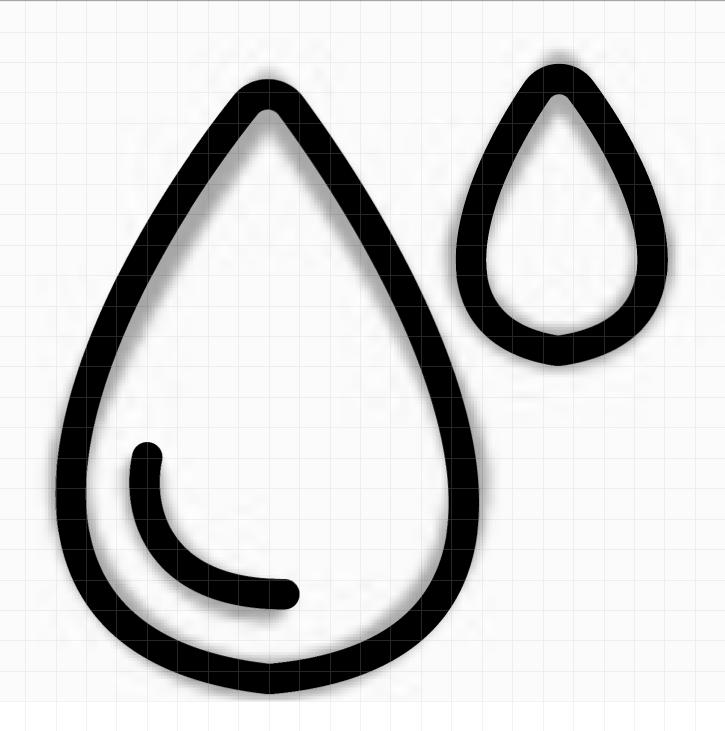
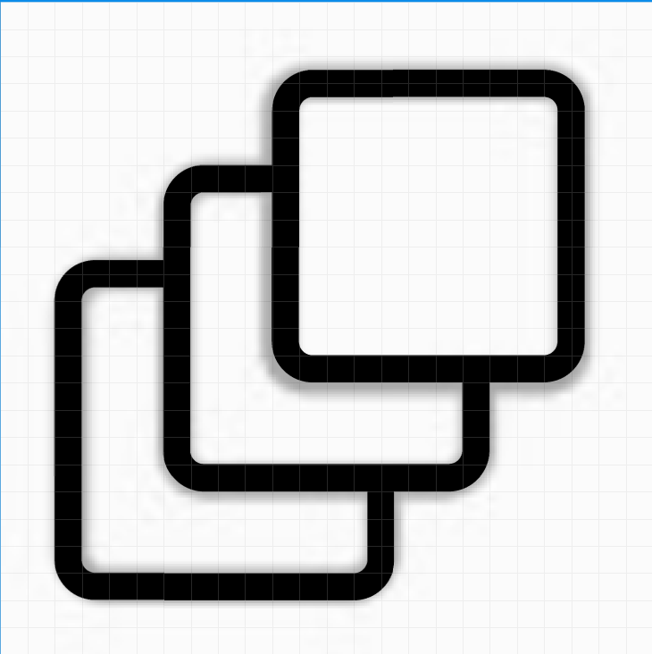
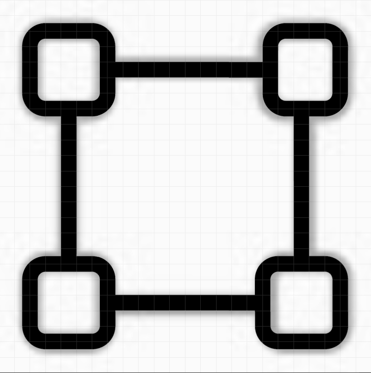

# Практична робота №5; ІПЗ 2.02 Замша Даніїл
# Криві Безьє, векторні об'єкти  у Figma. Створення векторних значків (іконок).
---

## Завдання:
#### Створити п'ять іконок за вибором у border (обводочному) стилі. Кожну іконку створюємо в окремому фреймі (24*24)
---

#### Результат:

---

---

---

---

---

#### Посилання на виконане завдання у Figma
https://www.figma.com/design/JEARCDXb0IF6Fyev3PiPTc/Icons?node-id=0-1&t=0zc1n6HE5PyFNtk3-1
