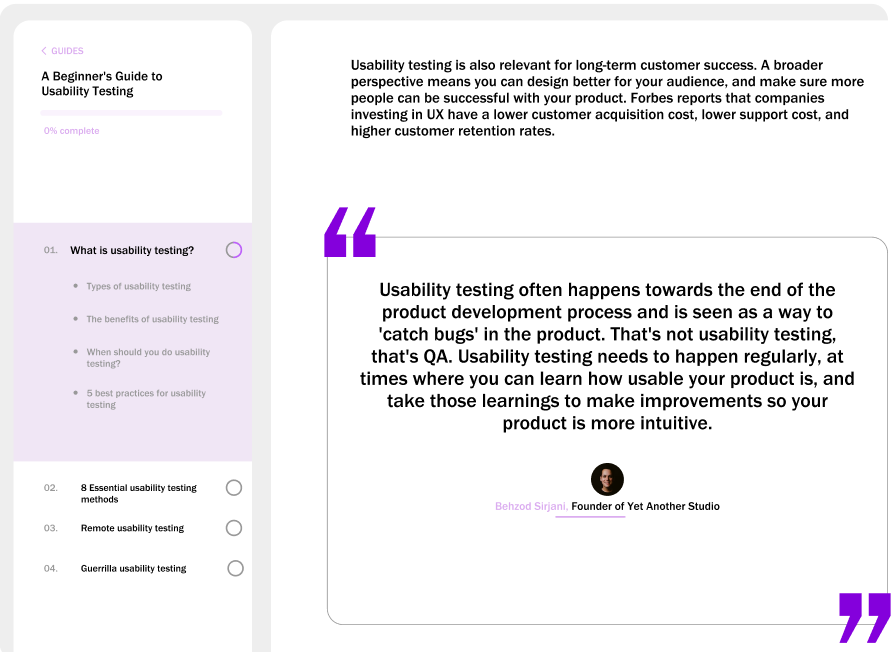

# Практична робота №7; ІПЗ 2.02 Замша Даніїл
# Типографіка  в дизайні користувальницького інтерфейсу. Частина 2
---

## Завдання:
#### Виконати завдання із файлу figma 3.
---

#### Результат:

---

#### Посилання на виконане завдання у Figma
https://www.figma.com/design/xyzkRuSzeScMhxWhbMQEId/Site?node-id=0-1&t=RDuIjWE2l2PsvWdk-1
