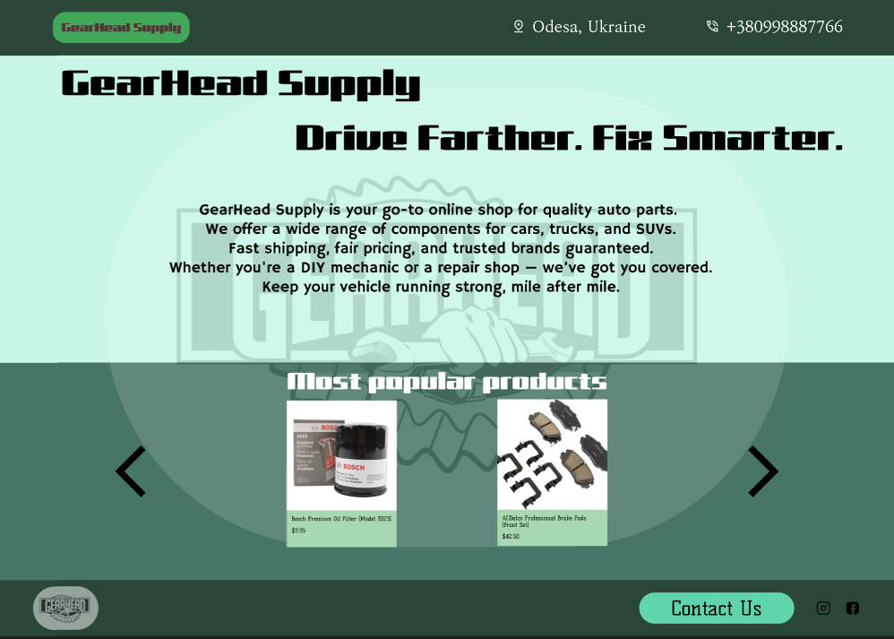
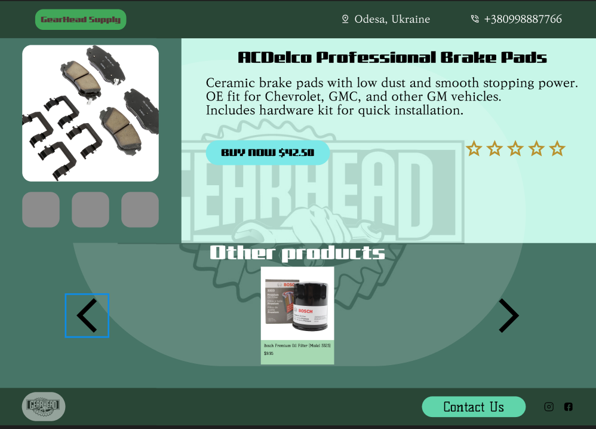

# Практична робота №9; ІПЗ 2.02 Замша Даніїл
# Розробка wireframe
---

## Завдання:
#### 1. Cтворити у Figma  деталізований  вайрфрейм  сайту для інтернет-магазину (головна сторінка та 2-3 сторінки товару).
#### Тематику обрати самостійно. Розмір екранів - desktop.
#### 2. Використати інструменти прототипування і зробити клікабельний прототип на основі вайфрейму.
---

#### Результат:

---

---

---

#### Посилання на виконані завдання у Figma

Вайрфрейм:
https://www.figma.com/design/wzRBkT9RrFjuRJVwfToxNW/Wireframe?node-id=0-1&t=QIdLmtXHiMS7s4MI-1

Клікабельний прототип:

